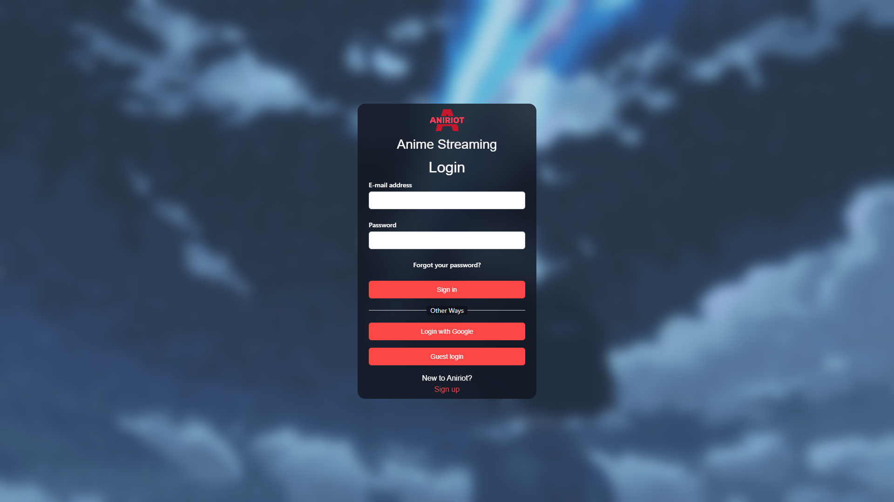
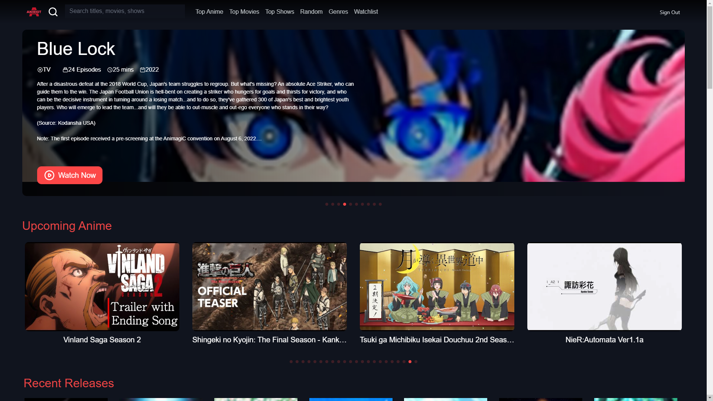
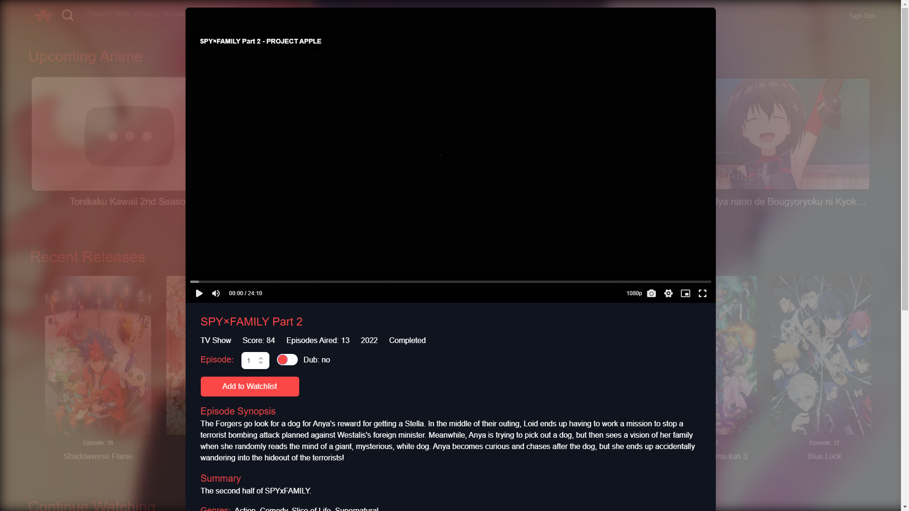
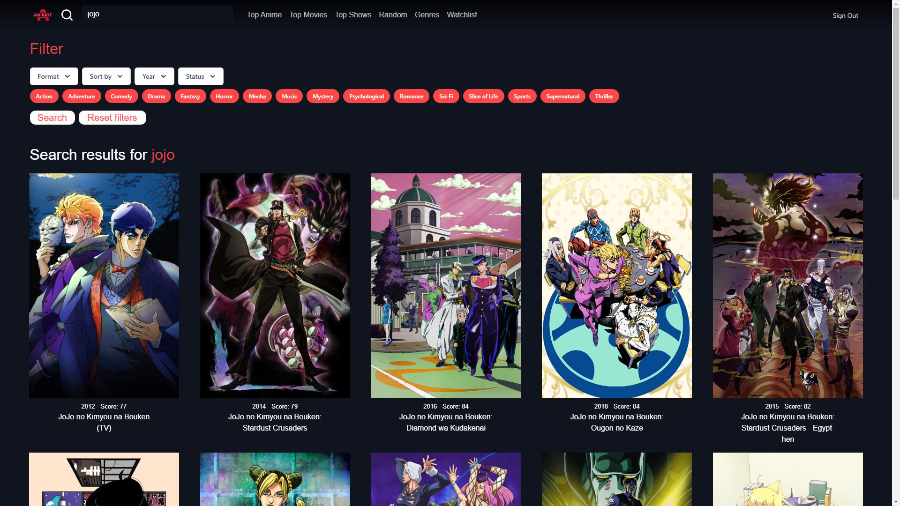
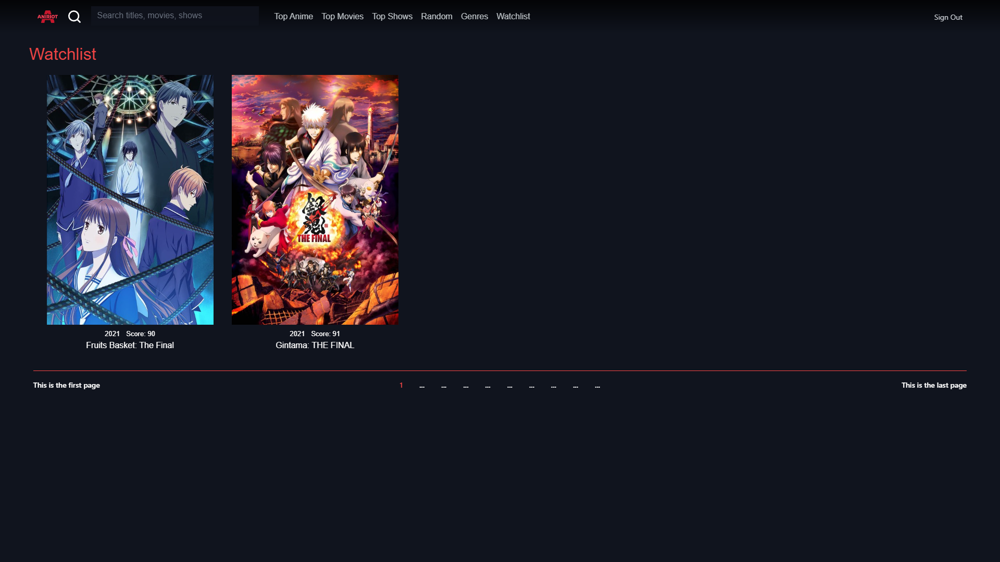

<h1>Aniriot</h1>

()

### Aniriot the ad--free anime streaming website✌️✌️.

Get free and fast anime streaming.

The official website is [aniriot-website.vercel.app](aniriot-website.vercel.app)

## Table of contents

- [Technologies](#technologies)
- [Screenshots](#screenshots)
- [Feature](#feature)

## Technologies

- Typescript
- TailwindCSS
- Firebase
- Redux and Framermotion
- API- Jikan, Consumet

## Screenshots

## Feature

- Anime streaming ad-free, Watchlist, Account login
- The base design of the website is inspired from Netflix
- Easy and beautiful UI/UX

## Contribution

Contributions are welcomed🙂🙂
 do star⭐⭐ the repo if u liked it!!
